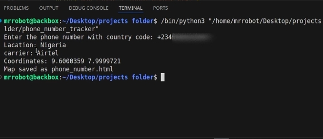

# 📱 PN_TRACKER - Track Phone Number Location Using Python

> 🔍 A simple but powerful **Python tool** to track the **location, carrier, timezone, and map position** of any phone number — just by entering it!  
> 🚨 For **educational and ethical purposes only**.

---



## 📌 As Seen On YouTube

📺 **Watch Full Tutorial Video**  
👉 [Click Here to Watch](https://youtube.com/YOUR_VIDEO_LINK)

---

## 🧠 What This Tool Does

With `PN_TRACKER`, you can:

- 🗺️ Get the **location** of a phone number (country or city)
- 📡 Identify the **mobile network carrier**
- 🕒 Detect the **timezone**
- 🌍 Pin the **approximate coordinates** on a **live map**
- 🧠 Understand how number-based geolocation works

It uses:

- `phonenumbers` — to parse and analyze phone numbers  
- `geopy` — to convert city names to coordinates  
- `timezonefinder` — to find the timezone  
- `folium` — to generate a beautiful map

---

## 🛠️ Requirements

Make sure you have Python 3 installed, then install the dependencies:

```bash
pip install phonenumbers geopy timezonefinder folium
```

Or use:

```bash
pip install -r requirements.txt
```

---

## 🚀 How to Use

1. **Clone the repo:**

```bash
git clone https://github.com/ACW360/PN_TRACKER.git
cd PN_TRACKER
```

2. **Run the script:**

```bash
python3 PN_TRACKER.py
```

3. **Enter the phone number** (with country code, e.g. `+2348012345678`)

4. The script will display:

- 📍 Location  
- 📡 Carrier  
- 🕒 Timezone  
- 🌍 Coordinates  
- 📁 Map saved as `phone_location.html`

---

## 🧪 Sample Output

```
📍 Location: Lagos
📡 Carrier: MTN
🌍 Coordinates: 6.5244, 3.3792
🕒 Timezone: Africa/Lagos
📁 Map saved as phone_location.html
```

---

## 📂 Files Included

| File | Description |
|------|-------------|
| `pn_tracker.py` | Main script to track phone numbers |
| `requirements.txt` | Python libraries to install |
| `README.md` | Project documentation |
| `phone_location.html` | Generated map (output) |
| `screenshot.png` | (Optional) Preview image of the map |

---

## 🛡️ Ethical Use Disclaimer

> This tool is made for **learning, awareness, and ethical research only**.  
> Do not use it to stalk, harass, or track individuals without their **explicit consent**.  
> Misuse may be illegal and punishable by law.

---

## ⭐ Support This Project

If you find this project helpful, please ⭐ it on GitHub, share the YouTube tutorial, and contribute improvements!

---

## 🙌 Credits

Created with ❤️ by [ACW360](https://github.com/ACW360)

